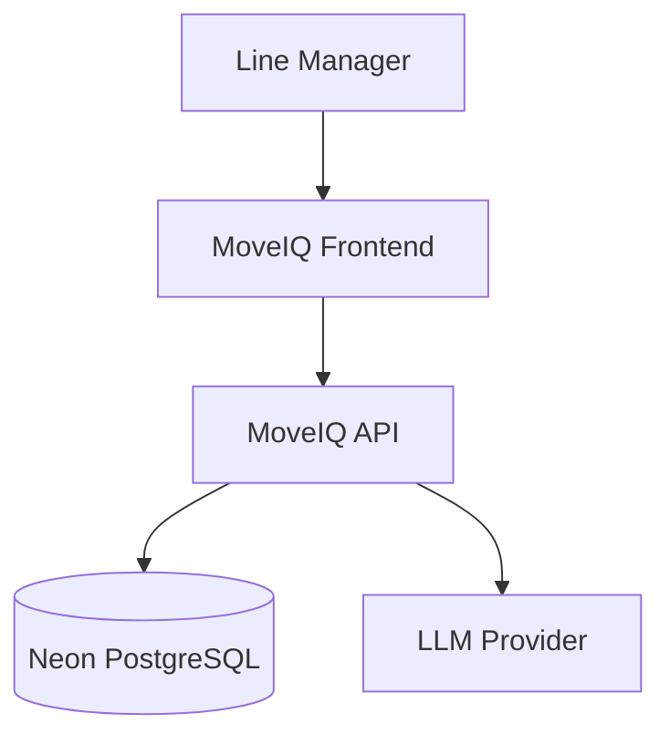
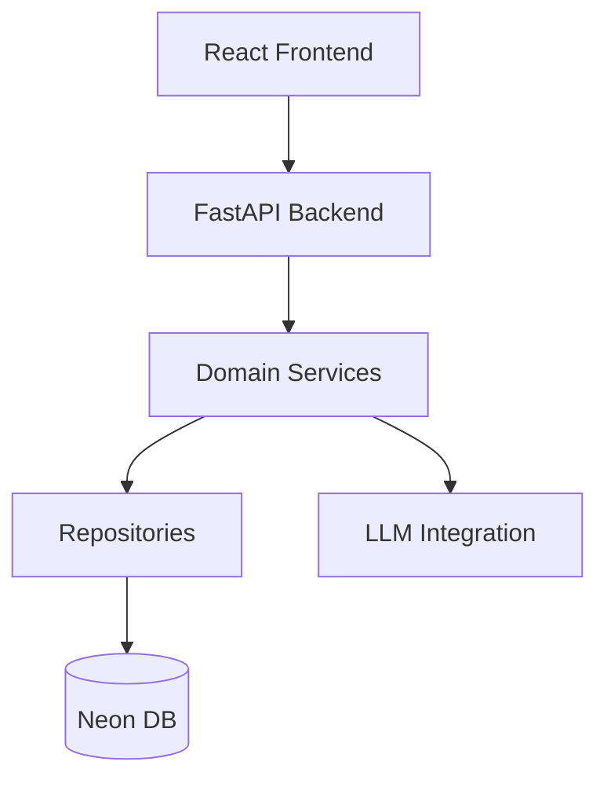
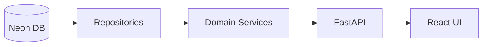
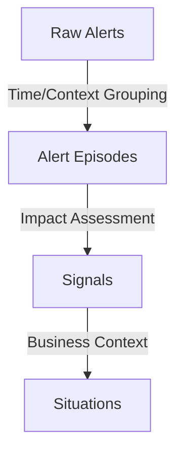
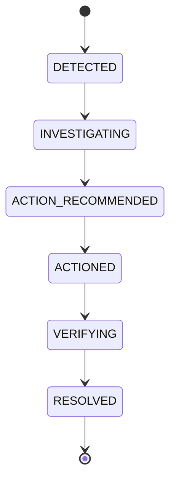

# MoveIQ Architecture Document

## 1. Product Overview
MoveIQ is an agentic mobility intelligence layer that transforms fragmented data signals (trip, employee, safety, cost, experience) into actionable business situations. It computes the impact of situations on business goals and allows decision-makers to evaluate and execute actions.

## 2. Design Principles
- **Never send raw data to LLM:** Use structured evidence packets.
- **Deterministic Analytics:** Aggregation and computation use strict SQL/Python.
- **Selective AI:** LLMs are reserved for reasoning, text generation, and decision comparison.
- **Action-Oriented:** Every situation must lead to a decision or action.

## 3. System Context Diagram


## 4. High-Level Architecture


## 5. Component Architecture
- **Frontend:** React, TypeScript, Tailwind, Recharts.
- **Backend:** FastAPI, Pydantic, asyncpg.
- **Database:** Neon PostgreSQL. Data pipelines load `staging`, `core`, and `analytics` schemas. MoveIQ owns `moveiq`.

## 6. Data Flow


## 7. Alert → Episode → Signal → Situation Flow


## 8. Situation Lifecycle


## 9. Shift Readiness Computation
**Formula:** `Ready = (Employees Expected On-Time) / (Total Scheduled Employees)`
**Definition of Ready:** An employee whose trip ETA is at or before the shift start time.

## 10. Analytics Preprocessing and Derived Metrics
Data is aggregated at the trip, shift, and employee grain using SQL inside the `analytics` schema.

## 11. Historical Benchmarking
Current metrics are compared against baseline profiles for shifts, routes, and vendors using a lookback period.

## 12. Context Builder & Line Manager Context Packet
The Context Packet contains 9 sections:
1. Scope
2. Current State
3. Historical
4. Alert
5. Root-Cause
6. Workforce
7. Future-Risk
8. Recommendation
9. Data Confidence

## 13. Impact Calculation
Business impact is computed deterministically using standard metrics (e.g., lost productivity hours, SLA breaches).

## 14. Decision Engine
Generates candidate actions, evaluates them against metrics, and builds a comparison matrix.

## 15. What-if Engine
Simulates the impact of a specific decision against current and future states.

## 16. LLM Architecture
- **Escalation Ladder:** Simple heuristics first, LLM for complex reasoning.
- **Trigger Policy:** LLM invoked only on material changes.
- **Evidence Packets:** LLMs consume JSON summaries, not raw rows.

## 17. Evidence Packet Example
```json
{
  "situation_id": "sit_123",
  "shift_readiness": 0.72,
  "episodes": 2,
  "impact": "High"
}
```

## 18. Replay Architecture
Uses a simulated clock (`app.replay.replay_engine`) to inject historical events sequentially for demo and testing.

## 19. Action/Outcome Architecture
Actions trigger state changes tracked in the `moveiq.outcomes` table.

## 20. Data Quality Architecture
Handles mangled CSVs, date format mismatches, and orphan alerts during the ETL to the `staging` schema.

## 21. API Architecture
- `/api/v1/home`
- `/api/v1/shifts`
- `/api/v1/readiness`
- `/api/v1/situations`
- `/api/v1/decisions`
- `/api/v1/ask`

## 22. Repository Architecture
Strict interfaces for data access (e.g., `SituationRepository`, `ShiftRepository`).

## 23. Scalability Strategy
Data evolution: CSV → DuckDB → Neon → Event streams (future).

## 24. LLM Cost Strategy
- Caching frequent queries.
- Material change detection (only trigger LLM if metrics shift by > 5%).
- Deduplication of identical context packets.

## 25. Failure Handling
Graceful degradation if LLM fails (fallback to static rules and historical data).

## 26. Observability
Structured JSON logging and correlation IDs for request tracing.

## 27. Testing Strategy
Unit tests for domain logic. Integration tests for repositories. E2E for critical flows.

## 28. Future Architecture Evolution
Migration to real-time event streams (Kafka/Redpanda).

## 29. Architecture Decisions / Tradeoffs
- Direct DB connection instead of ORM for performance.
- Precomputed analytics tables for dashboard speed.

## 30. What is NOT built in MVP
- Real-time GPS stream ingestion.
- Complex multi-agent negotiation.
